<div align="center">
  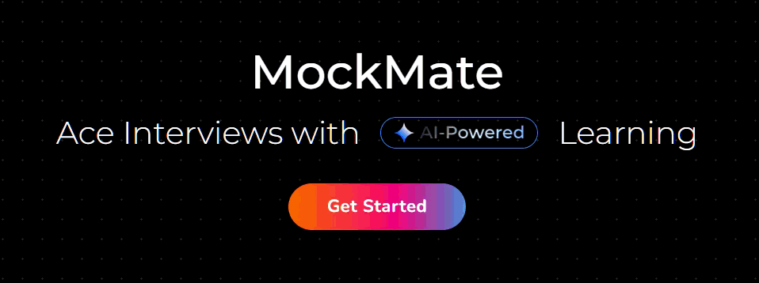
  
  <h1>MockMate</h1>
  
  <p><strong>AI-Powered Interview Preparation Platform</strong></p>

  <p>
    <a href="#features">Features</a> •
    <a href="#tech-stack">Tech Stack</a> •
    <a href="#system-architecture">Architecture</a> •
    <a href="#getting-started">Getting Started</a>
  </p>

  
  
  
</div>

---

## 🚀 Overview

**MockMate** is a comprehensive interview preparation platform engineered to help candidates master their technical interviews. By leveraging advanced AI and real-time video processing, MockMate provides an immersive simulation of real-world interview scenarios.

From generating tailored questions based on your resume and role to analyzing your speech and answers in real-time, MockMate offers end-to-end coaching.

## ✨ Features

| Feature | Description | Preview |
|:---:|---|:---:|
| **Live AI Interview** | Real-time video interview simulation with AI-generated questions and immediate feedback. Uses media cleanup to ensure privacy. | 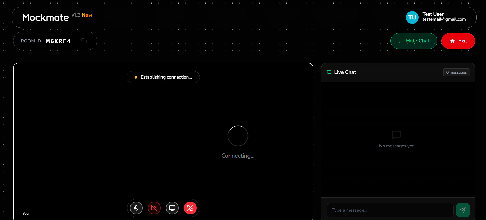 |
| **Interactive Dashboard** | Track your progress, view past session scores, and manage your interview schedule. | 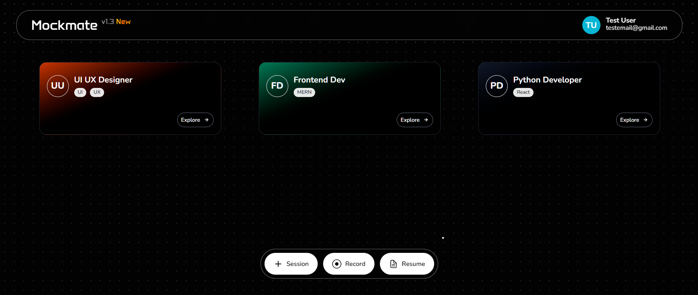 |
| **Resume Analysis** | Upload your resume to get custom-tailored questions that match your experience level. | 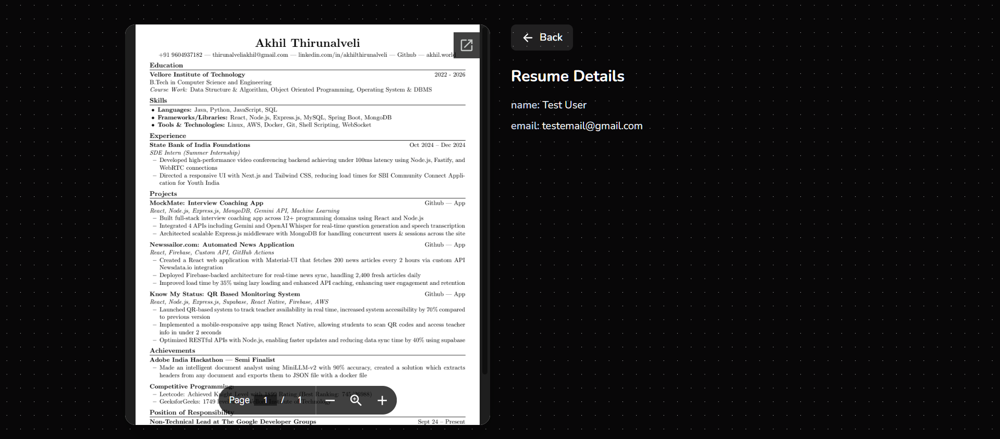 |
| **Concept Drill** | Deep dive into specific topics with AI-driven explanations and code examples. | 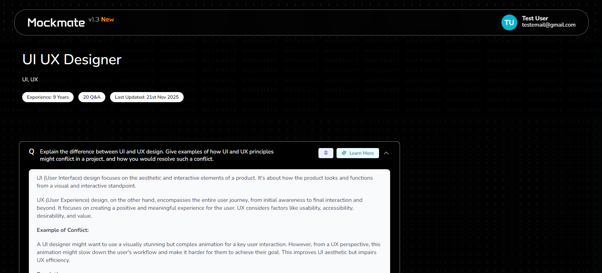 |

### 📄 ATS Resume Checker
An advanced Applicant Tracking System (ATS) simulation tool designed to optimize resumes for maximum visibility.
- **Twin-Panel Interface**: A sleek split-screen layout allowing side-by-side comparison of your resume and job description.
- **Instant Analysis**: Real-time parsing of PDF/DOCX files to extract text and analyze content against job requirements.
- **Detailed Scoring**: Provides a match score, missing keywords, hard/soft skills analysis, and actionable formatting feedback.
- **Smart Recommendations**: Suggests improvements for readability, experience impact, and contact information completeness.

<div align="center">
  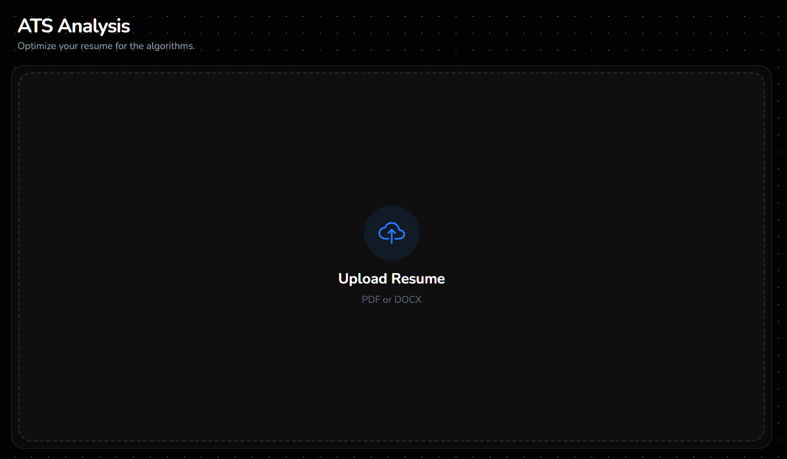
  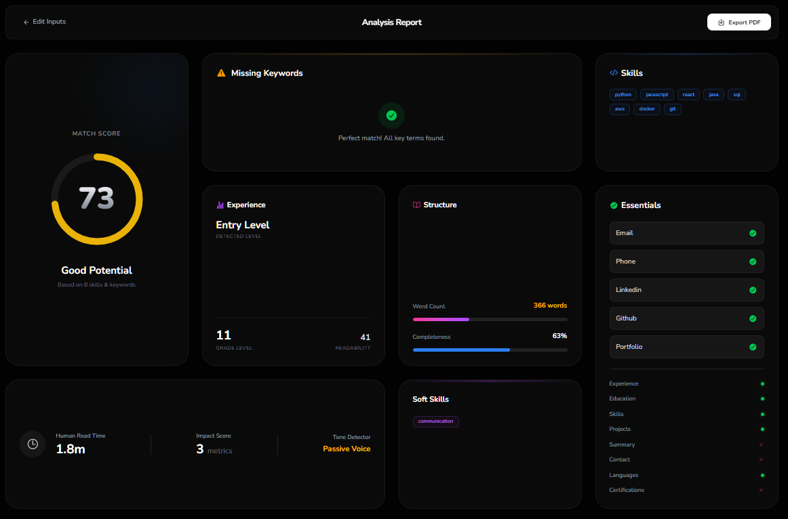
</div>

<div align="center">
  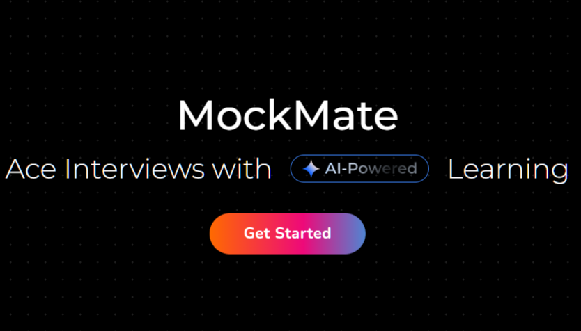
  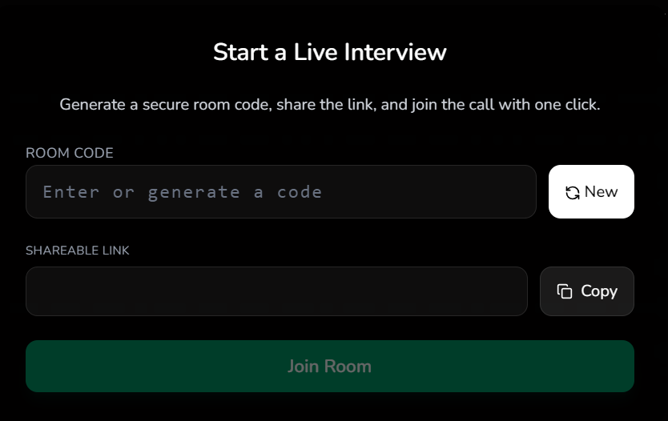
</div>

## 🛠 Tech Stack

### Frontend


### Backend


### AI & APIs


## 🏗 System Architecture

The application follows a modern microservices-inspired monolithic architecture with real-time capabilities.

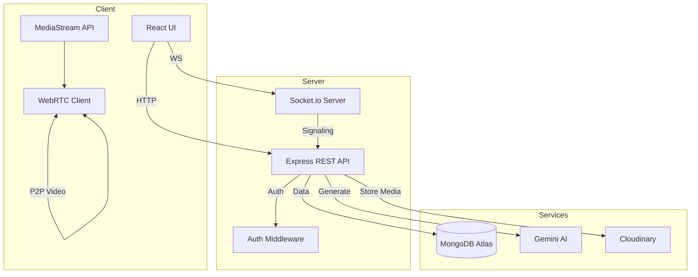

## 🔄 User Flow

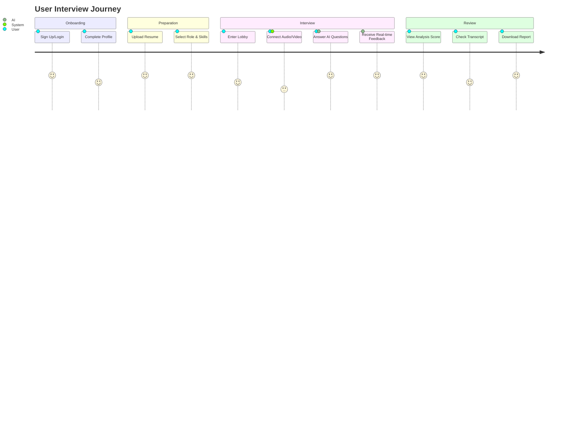

## ⚡ Getting Started

### Prerequisites
- **Node.js**: v18.0.0 or higher
- **npm**: v8.0.0 or higher
- **MongoDB**: Local URI or Atlas Connection String

### 📥 Installation

1. **Clone the repository**
   ```bash
   git clone https://github.com/akhilthirunalveli/MockMate.git
   cd MockMate
   ```

2. **Install Backend Dependencies**
   ```bash
   cd backend
   npm install
   ```

3. **Install Frontend Dependencies**
   ```bash
   cd ../frontend
   npm install
   ```

### 🔑 Environment Variables

You need to create a `.env` file in **both** the `frontend` and `backend` directories.

#### Backend (`backend/.env`)

| Variable | Description |
|---|---|
| `PORT` | Server port (e.g., 5000) |
| `MONGO_URI` | MongoDB Connection String |
| `JWT_SECRET` | Secret key for JWT signing |
| `GEMINI_API_KEY` | Google Gemini AI API Key |
| `CLOUDINARY_CLOUD_NAME` | Cloudinary Name |
| `CLOUDINARY_API_KEY` | Cloudinary API Key |
| `CLOUDINARY_API_SECRET` | Cloudinary API Secret |

#### Frontend (`frontend/.env`)

| Variable | Description |
|---|---|
| `VITE_BASE_URL` | Backend API URL (e.g., http://localhost:5000) |
| `VITE_FIREBASE_API_KEY` | Firebase API Key |
| `VITE_FIREBASE_AUTH_DOMAIN` | Firebase Auth Domain |
| `VITE_FIREBASE_PROJECT_ID` | Firebase Project ID |
| `VITE_FIREBASE_APP_ID` | Firebase App ID |
| `VITE_METERED_USERNAME` | Metered Turn Server Username (Optional) |
| `VITE_METERED_CREDENTIAL` | Metered Turn Server Credential (Optional) |

### 🚀 Running the App

 **Run both Servers Concurrently (Recommended if configured)**
   ```bash
   # From root if concurrently is set up, otherwise run separate terminals:
   ```

**Terminal 1 (Backend)**
```bash
cd backend
npm run dev
```

**Terminal 2 (Frontend)**
```bash
cd frontend
npm run dev
```

Visit `http://localhost:5173` to view the application.


Contributions are welcome! Please feel free to submit a Pull Request.

1. Fork the Project
2. Create your Feature Branch (`git checkout -b feature/AmazingFeature`)
3. Commit your Changes (`git commit -m 'Add some AmazingFeature'`)
4. Push to the Branch (`git push origin feature/AmazingFeature`)
5. Open a Pull Request

---

<div align="center">
  <p>Made with ❤️ by the Akhil </p>
</div>
